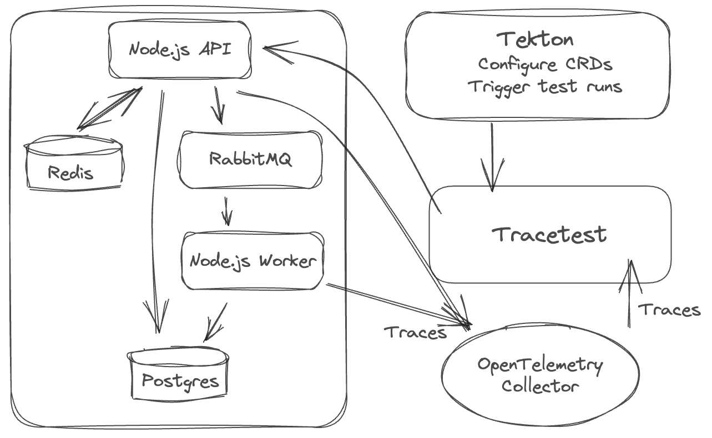
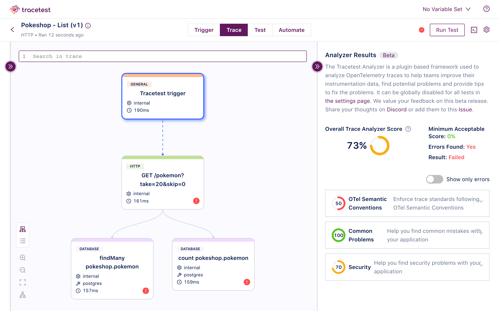
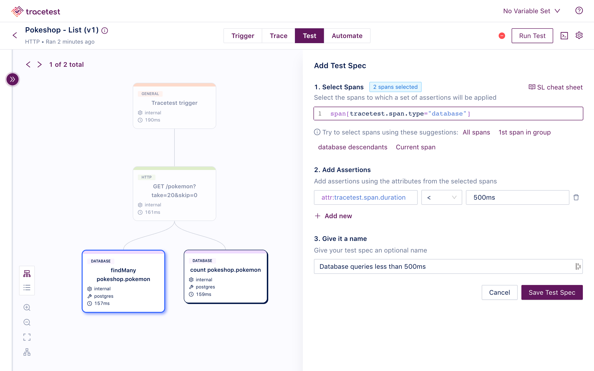
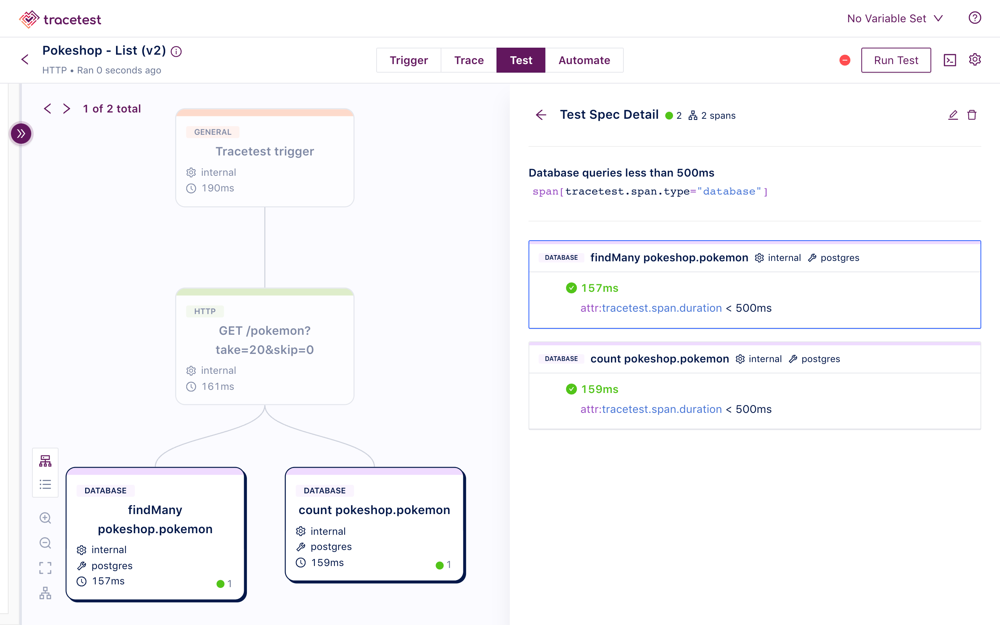
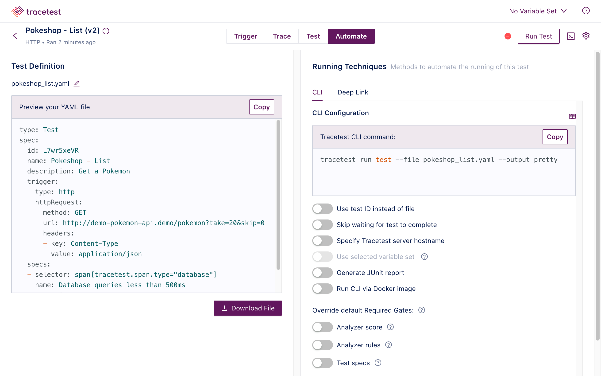
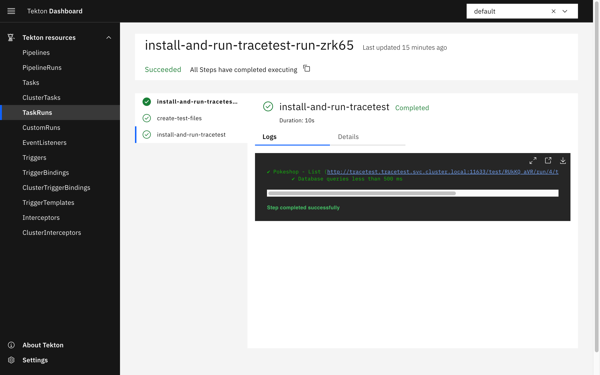
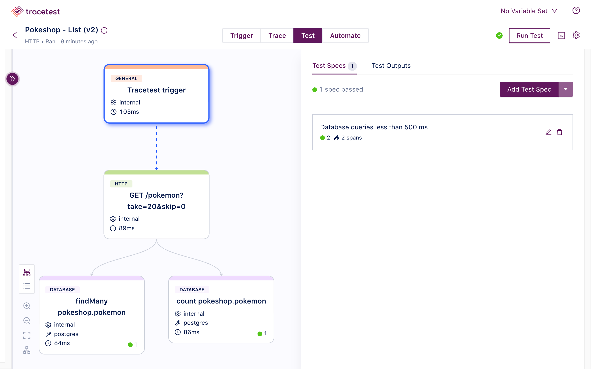

[Tekton](https://github.com/tektoncd/pipeline) is an open-source framework for creating efficient CI/CD systems. This empowers developers to seamlessly construct, test, and deploy applications across various cloud environments and on-premise setups.

[Tracetest](https://github.com/kubeshop/tracetest), an open-source testing tool that uses OpenTelemetry traces for testing, offers a sophisticated test harness for distributed cloud-native apps. It empowers users to test their apps by harnessing data from distributed traces produced by OpenTelemetry. This enables creating test specs and assertions that validate whether an application aligns with the intended behavior, as defined by pre-established test parameters.

## Why use distributed traces for testing?

The rationale behind integrating Tracetest with Tekton is compelling. Tracetest [uses pre-existing OpenTelemetry instrumentation](https://tracetest.io/features) to execute assertions against every part of an HTTP transaction.

[Combining Tracetest and Tekton](https://docs.tracetest.io/ci-cd-automation/tekton-pipeline) enables adding trace-based testing into CI/CD pipelines within your Kubernetes cluster. This integration not only furnishes the capability to initiate planned test cycles and synthetic testing but also preserves the core tenets of trace-based testing. It empowers exhaustive and in-depth assertions with trace data.

## Infrastructure Overview

The following is high level sequence diagram on how Tekton and Tracetest interact with the different pieces of the system.



## 1. Install Tekton Pipelines, Triggers, and Dashboard

Install Tekton Pipelines by following [these instructions for Pipelines](https://tekton.dev/docs/getting-started/tasks/#install-tekton-pipelines), [these instructions for Triggers](https://tekton.dev/docs/getting-started/triggers/#install-tekton-triggers), and [these instructions for Dashboard](https://tekton.dev/docs/dashboard/install/). Or, run the command below.

```bash
kubectl apply --filename \
https://storage.googleapis.com/tekton-releases/pipeline/latest/release.yaml

kubectl apply --filename \
https://storage.googleapis.com/tekton-releases/triggers/latest/release.yaml

kubectl apply --filename \
https://storage.googleapis.com/tekton-releases/triggers/latest/interceptors.yaml

kubectl apply --filename \
https://storage.googleapis.com/tekton-releases/dashboard/latest/release.yaml
```

## 2. Install Tracetest CLI

Install Tracetest CLI by following [these instructions](https://docs.tracetest.io/getting-started/installation) for your OS.

```bash
# MacOS example
brew install kubeshop/tracetest/tracetest
```

## 3. Install Tracetest in Your Kubernetes Cluster

```bash
tracetest server install

[Output]
How do you want to run TraceTest? [type to search]:
  Using Docker Compose
> Using Kubernetes
```

Select `Using Kubernetes`.

```text
[Output]
Do you have OpenTelemetry based tracing already set up, or would you like us to install a demo tracing environment and app? [type to search]:
  I have a tracing environment already. Just install Tracetest
> Just learning tracing! Install Tracetest, OpenTelemetry Collector and the sample app.
```

Select `Just learning tracing! Install Tracetest, OpenTelemetry Collector and the sample app.`.

Confirm that Tracetest is running:

```bash
kubectl get all -n tracetest

[Output]
NAME                                  READY   STATUS    RESTARTS        AGE
pod/otel-collector-7f4d87489f-vp6zn   1/1     Running   0               5m41s
pod/tracetest-78b9c84c57-t4prx        1/1     Running   3 (4m15s ago)   5m29s
pod/tracetest-postgresql-0            1/1     Running   0               5m42s

NAME                              TYPE        CLUSTER-IP      EXTERNAL-IP   PORT(S)               AGE
service/otel-collector            ClusterIP   10.96.173.226   <none>        4317/TCP              5m46s
service/tracetest                 ClusterIP   10.96.248.146   <none>        11633/TCP,4317/TCP   5m42s
service/tracetest-postgresql      ClusterIP   10.96.155.147   <none>        5432/TCP              5m42s
service/tracetest-postgresql-hl   ClusterIP   None            <none>        5432/TCP              5m42s

NAME                             READY   UP-TO-DATE   AVAILABLE   AGE
deployment.apps/otel-collector   1/1     1            1           5m46s
deployment.apps/tracetest        1/1     1            1           5m42s

NAME                                        DESIRED   CURRENT   READY   AGE
replicaset.apps/otel-collector-7f4d87489f   1         1         1       5m46s
replicaset.apps/tracetest-78b9c84c57        1         1         1       5m42s

NAME                                    READY   AGE
statefulset.apps/tracetest-postgresql   1/1     5m42s
```

By default, Tracetest is installed in the `tracetest` namespace.

To explore the Tracetest Web UI, run the command:

```bash
kubectl --kubeconfig <path-to-your-home>/.kube/config --context <your-cluster-context> --namespace tracetest port-forward svc/tracetest 11633
```


## 4. Create a Test in Tracetest

Start by clicking `Create` > `Create New Test` > `HTTP Request` > `Next` > `Choose Example` (dropdown) > `Pokeshop - List` (generates a sample test from the Tracetest demo) > `Next` > `URL` is prefilled with `http://demo-pokemon-api.demo/pokemon?take=20&skip=0` > `Create & Run`.

This will trigger the test and display a distributed trace in the `Trace` tab to run assertions against.



Proceed to add a test spec to assert all database queries return within 500 ms. Click the `Test` tab and proceed to click the `Add Test Spec` button.

In the span selector make sure to add this selector:

```css
span[tracetest.span.type="database"]
```

In the assertion field add:

```css
attr:tracetest.span.duration < 500ms
```

Save the test spec and publish the test.



The database spans that are returning in less than `500ms` are labeled in green.



This is an example of a trace-based test that asserts against every single part of an HTTP transaction, including all interactions with the database.

Let's introduce how Tekton makes it possible to run this test as part of your CI/CD pipeline.

## 5. Create a Task in Tekton

Click the `Automate` tab.



This contains both a YAML definition for the test run and a guide how to run the test with the Tracetest CLI.

Save this into a file called `test-api.yaml`:

```yaml
# test-api.yaml

type: Test
spec:
  id: L7wr5xeVR
  name: Pokeshop - List
  description: Get a Pokemon
  trigger:
    type: http
    httpRequest:
      method: GET
      url: http://demo-pokemon-api.demo/pokemon?take=20&skip=0
      headers:
      - key: Content-Type
        value: application/json
  specs:
  - selector: span[tracetest.span.type="database"]
    name: Database queries less than 500ms
    assertions:
    - attr:tracetest.span.duration < 500ms
```

Note that you'll use this CLI command to run the test:

```bash
tracetest run test --file test-api.yaml --required-gates test-specs --output pretty
```

It set's the required gates to pass the test by only validating the test specs.

Create another YAML file, name it `install-and-run-tracetest.yaml`.
This contains the Tekton `Task` definition.

```yaml
# install-and-run-tracetest.yaml

apiVersion: tekton.dev/v1beta1
kind: Task
metadata:
  name: install-and-run-tracetest
spec:
  steps:
    - name: create-test-files
      image: ubuntu
      script: |
        #!/usr/bin/env bash
        cat <<EOF >/workspace/test-api.yaml
        type: Test
        spec:
          id: L7wr5xeVR
          name: Pokeshop - List
          description: Get a Pokemon
          trigger:
            type: http
            httpRequest:
              method: GET
              url: http://demo-pokemon-api.demo/pokemon?take=20&skip=0
              headers:
              - key: Content-Type
                value: application/json
          specs:
          - selector: span[tracetest.span.type="database"]
            name: Database queries less than 500ms
            assertions:
            - attr:tracetest.span.duration < 500ms
        EOF
      volumeMounts:
      - name: custom
        mountPath: /workspace
    - name: install-and-run-tracetest
      image: kubeshop/tracetest:v0.13.3
      # The official Tracetest image comes with the Tracetest CLI installed
      script: |
        # Configure and Run Tracetest CLI
        tracetest configure -g --endpoint http://tracetest.tracetest.svc.cluster.local:11633/
        tracetest run test --file /workspace/test-api.yaml --required-gates test-specs --output pretty
      volumeMounts:
      - name: custom
        mountPath: /workspace
  volumes:
  - name: custom
    emptyDir: {}
```

```bash
kubectl apply -f ./install-and-run-tracetest.yaml
```

Make sure to use the Tracetest service as the endpoint for your `tracetest configure` command. This may vary depending on your installation.

```bash
http://tracetest.tracetest.svc.cluster.local:11633/
```

## 6. Run the Tracetest Trace-based Test in Tekton with a TaskRun

Finally, to run the test, create a `TaskRun`.

Create a file called `install-and-run-tracetest-run.yaml`.

```yaml
# install-and-run-tracetest-run.yaml

apiVersion: tekton.dev/v1beta1
kind: TaskRun
metadata:
  name: install-and-run-tracetest-run
spec:
  taskRef:
    name: install-and-run-tracetest
```

```bash
kubectl apply -f ./install-and-run-tracetest-run.yaml
```

Here's how to check the logs:

```bash
kubectl logs --selector=tekton.dev/taskRun=install-and-run-tracetest-run
```

You can also trigger a Task with the [Tekton CLI](https://tekton.dev/docs/cli/).

```bash
tkn task start install-and-run-tracetest

[Output]
TaskRun started: install-and-run-tracetest-run-xmhfg
```

In order to track the TaskRun progress run:

```bash
tkn taskrun logs install-and-run-tracetest-run-gccjk -f -n default

[Output]
[install-and-run-tracetest] ✔ Pokeshop - List (http://tracetest.tracetest.svc.cluster.local:11633/test/RUkKQ_aVR/run/3/test) - trace id: 0549641531d3221ded696f2fd3b20ce6
[install-and-run-tracetest] 	✔ Database queries less than 500 ms
[install-and-run-tracetest]
```

To preview which tasks failed or succeeded, use this command:

```bash
tkn taskrun list

[Output]
NAME                                  STARTED          DURATION   STATUS
install-and-run-tracetest-run         3 minutes ago    23s        Succeeded
install-and-run-tracetest-run-nmptn   7 minutes ago    33s        Failed
install-and-run-tracetest-run-bhf7v   20 minutes ago   23s        Succeeded
install-and-run-tracetest-run-wm8bj   21 minutes ago   22s        Succeeded
install-and-run-tracetest-run-dbrbt   23 minutes ago   24s        Failed
```

## 7. Trigger Trace-based Tests with an EventListener

By using Tektons's [triggers](https://tekton.dev/docs/getting-started/triggers/), you can trigger tests via an [eventlistener](https://tekton.dev/docs/getting-started/triggers/#create-an-eventlistener).

### Create a TriggerTemplate and TriggerBinding

```yaml
# install-and-run-tracetest-trigger-binding.yaml

apiVersion: triggers.tekton.dev/v1beta1
kind: TriggerTemplate
metadata:
  name: install-and-run-tracetest-template
spec:
  resourcetemplates:
  - apiVersion: tekton.dev/v1beta1
    kind: TaskRun
    metadata:
      generateName: install-and-run-tracetest-run-
    spec:
      taskRef:
        name: install-and-run-tracetest
```

```yaml
# install-and-run-tracetest-trigger-template.yaml

apiVersion: triggers.tekton.dev/v1beta1
kind: TriggerBinding
metadata:
  name: install-and-run-tracetest-binding
spec:
  params:
  - name: run
    value: $(body.run)
```

```bash
kubectl apply -f install-and-run-tracetest-trigger-binding.yaml
kubectl apply -f install-and-run-tracetest-trigger-template.yaml
```

### Create an EventListener

```yaml
# install-and-run-tracetest-event-listener.yaml

apiVersion: triggers.tekton.dev/v1beta1
kind: EventListener
metadata:
  name: install-and-run-tracetest-event-listener
spec:
  serviceAccountName: tekton-robot
  triggers:
    - name: install-and-run-tracetest-trigger 
      bindings:
      - ref: install-and-run-tracetest-binding
      template:
        ref: install-and-run-tracetest-template
```

The EventListener requires a service account to run. To create the service account for this example create a file named `tekton-robot-rbac.yaml` and add the following:

```yaml
# tekton-robot-rbac.yaml

apiVersion: v1
kind: ServiceAccount
metadata:
  name: tekton-robot
---
apiVersion: rbac.authorization.k8s.io/v1
kind: RoleBinding
metadata:
  name: triggers-example-eventlistener-binding
subjects:
- kind: ServiceAccount
  name: tekton-robot
roleRef:
  apiGroup: rbac.authorization.k8s.io
  kind: ClusterRole
  name: tekton-triggers-eventlistener-roles
---
apiVersion: rbac.authorization.k8s.io/v1
kind: ClusterRoleBinding
metadata:
  name: triggers-example-eventlistener-clusterbinding
subjects:
- kind: ServiceAccount
  name: tekton-robot
  namespace: default
roleRef:
  apiGroup: rbac.authorization.k8s.io
  kind: ClusterRole
  name: tekton-triggers-eventlistener-clusterroles
```

```bash
kubectl apply -f tekton-robot-rbac.yaml
kubectl apply -f install-and-run-tracetest-event-listener.yaml
```

Enable port forwarding.

```bash
kubectl port-forward service/el-install-and-run-tracetest-event-listener 8080
```

Hitting the port forwarded endpoint will trigger the task.

```text
curl -v \
   -H 'content-Type: application/json' \
   -d '{"run":true}' \
   http://localhost:8080
```

Checking the `taskruns` will confirm this.

```bash
tkn taskrun list

[Output]
NAME                                  STARTED          DURATION   STATUS
install-and-run-tracetest-run-69zrz   4 seconds ago    ---        Running(Pending)
```

Finally, check the logs:

```bash
tkn taskrun logs -f install-and-run-tracetest-run-69zrz

[Output]
[install-and-run-tracetest] ✔ Pokeshop - List (http://tracetest.tracetest.svc.cluster.local:11633/test/RUkKQ_aVR/run/5/test)
[install-and-run-tracetest] 	✔ Database queries less than 500 ms
```

## 8. Preview Trace-based Tests with Tekton Dashboard

Start by port forwarding the Tekton Dashboard.

```bash
kubectl --namespace tekton-pipelines port-forward svc/tekton-dashboard 9097:9097
```

Open it up in your browser at `http://localhost:9097`. Navigate to the TaskRuns. Open the TaskRun you ran above.



This lets you easily preview the Tracetest test runs by copying the link to the Tracetest instance. However, because you're using an internal service for Tracetest, make sure to use the port forwarded link to access the Tracetest Dashboard.

Replace:

```text
http://tracetest.tracetest.svc.cluster.local:11633/test/RUkKQ_aVR/run/4/test
```

With:

```text
http://localhost:11633/test/RUkKQ_aVR/run/4/test
```



Alternatively, you can use the Deep Link feature to trigger a new test run directly via the browser like this:

```text
http://localhost:11633/test/RUkKQ_aVR/run?
```

## Conclusion

To sum up, the partnership between Tekton and Tracetest offers a powerful approach to testing Kubernetes with distributed tracing. Tekton provides a framework for building efficient CI/CD pipelines. Tracetest utilizes OpenTelemetry traces for testing, making it a valuable tool for testing cloud-native apps.

By combining Tracetest and Tekton, developers gain the ability to integrate trace-based testing into Kubernetes clusters. This integration allows for scheduled test cycles, synthetic tests, and thorough assertions using trace data. This cohesive approach ensures that applications align with intended behavior, improving overall reliability and functionality. As cloud-native apps continue to evolve, this integration showcases how to enhance testing as well.

## Next Steps

To explore more options that Tracetest gives you, check out [the docs](https://docs.tracetest.io/) to learn more!

If you like what the [Tekton](https://github.com/tektoncd/pipeline) and [Tracetest](https://github.com/kubeshop/tracetest) communities are doing, please leave a ⭐️ in GitHub.
