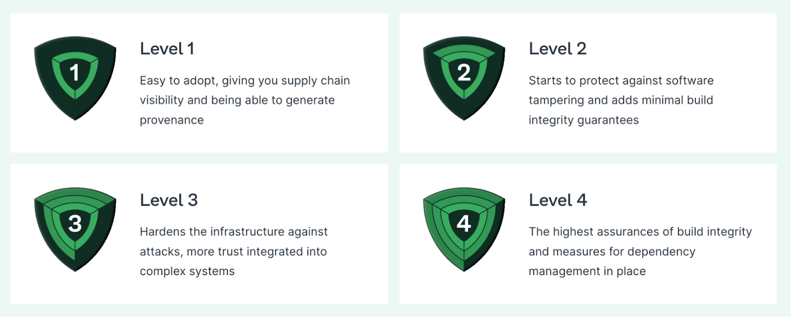
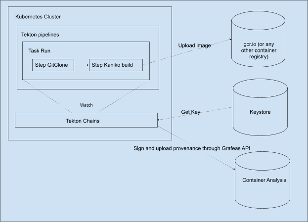
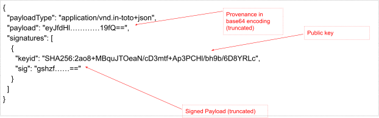
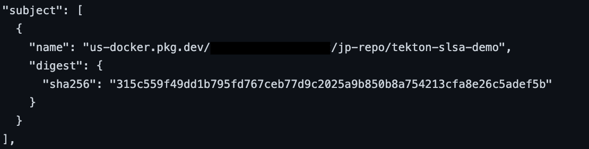
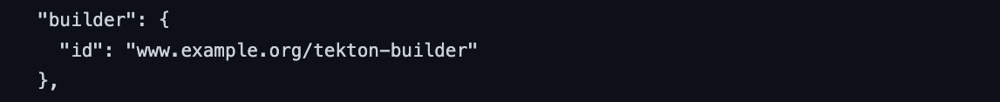
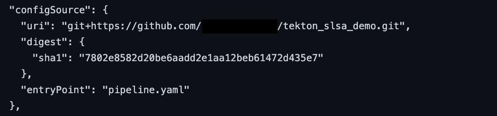
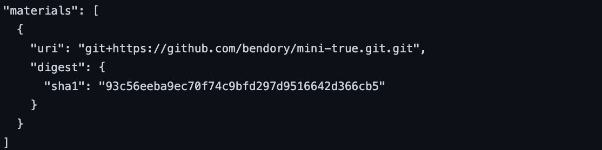

# Overview
As application developers, we achieve amazing results quickly by leveraging a rich ecosystem of freely available libraries, modules and frameworks that provide ready-to-use capabilities and abstract away from underlying complexity. This is so foundational to how we work that we'll nonchalantly build and publish an app that pulls in hundreds of dependencies without even thinking about it. And it's only fairly recently, in the wake of some very high profile and high impact compromises, that we've started to reckon with the fact that this wonderful ecosystem is also a security quagmire. All of the dependencies that feed into your build make up your software supply chain, and supply chains need to be secured. In this post, we'll show how an increasingly popular open source CI/CD system, Tekton, implements the [OpenSSF SLSA][slsa] framework to provide you with supply chain security guarantees.

# Software Supply Chain Security
A software supply chain is anything that goes into or affects your code from development, through your CI/CD pipeline, until it gets deployed into production. Increasingly, the software supply chain has become a vector for attacks. The recent Log4j, SolarWinds, Kaseya, and Codecov hacks highlight vulnerable surface areas exposed by an insecure software supply chain.

Between 2020 and 2021, there has been a [650% Surge][650] in OSS supply chain attacks, and [Gartner projects][gartner-projects] that 45% of organizations worldwide will have experienced software supply chain attacks by 2025.

# Supply Chains Levels for Software Artifacts (SLSA)
The Supply chain Levels for Software Artifacts (SLSA) framework is a check-list of controls to prevent tampering, improve integrity, and increase security in the packages and infrastructure used by projects, businesses or enterprises. SLSA formalizes criteria around software supply chain integrity to help the industry and open source ecosystem secure the software development life cycle at all stages.

As part of the framework, SLSA has multiple levels of assurances. These levels contain industry-recognized best practices to create four levels of increasing assurance.



SLSA provides a [set of requirements][slsa-l1] that needs to be met for an artifact to be considered for a particular SLSA level.

# Tekton + Tekton Chains
Tekton is a powerful and flexible, open source, cloud-native framework for creating CI/CD systems, allowing developers to build, test, and deploy across cloud providers and on-premise systems. Tekton consists of several subprojects which are relevant to SLSA:

* Pipelines: A system that allows one to define a pipeline of CI/CD tasks and
  have it be orchestrated by the Tekton controller.
* Chains: A standalone system which observes Pipelines and generates provenance
  for the artifacts built by Pipelines.  Tekton build processes are defined as
  tasks and pipelines. A Task is a collection of Steps that are defined and
  arranged in a specific order of execution as part of a continuous integration
  flow.

A Pipeline is a collection of Tasks defined and arranged in a specific order of execution as part of a continuous integration flow.

A TaskRun is an instantiation of a Task with specific inputs, outputs and execution parameters while a PipelineRun is an instantiation of a Pipeline.

A Task/Pipeline can define a set of Results. TaskRuns and PipelineRuns create Results as defined in the Task/Pipeline. Results are used to communicate to Tekton Chains run specifics like the uri and the digest of the built artifact.

Tasks, Pipelines, TaskRuns and PipelineRuns are defined through yaml files. The entire build is defined by the set of yaml files which define Tekton Tasks, Pipelines, TaskRuns and PipelineRuns. These yaml files can be checked in as code and run directly from the code repository.

# Getting to SLSA L1: Automation + Provenance
For an artifact to be [SLSA L1][slsa-l1] compliant it should satisfy the following:

1. [Scripted build][scripted]: All build steps are fully defined in some sort of
   “build script”. The only manual command, if any, is to invoke the build
   script.
1. [Provenance][available]: The provenance is available to the consumer in a
   format that the consumer accepts. The format SHOULD be in-toto SLSA
   Provenance, but another format MAY be used if both producer and consumer
   agree and it meets all the other requirements.

Tekton Tasks, TaskRuns, Pipelines and PipelineRuns are specified in yaml files. These yaml files can be considered as scripts and can even be checked in into a code repository. These could also be run from code repositories. Tekton Chains provides a way to generate provenance in in-toto SLSA format. As such, Tekton can easily make builds which satisfy the SLSA L1 requirements.

{}
The linked example demonstrates SLSA level 2 on Google Cloud, but the same
principles are applicable to any build environment.
{}

Let's follow through with [an example][example-repo], which has the following files:

* `setup.sh`: Sets up Google cloud to run an instance of the build specified in
  `pipeline_run.yaml`. It also installs Tekton Pipeline and Tekton Chains. In the
  production environment, this would be run once to set up the environment and
  all builds would use the same environment.
* `pipeline_run.yaml`: This file is the actual build file that is run by Tekton
  Pipelines. The build here first clones a Github repo, builds the container
  specified in the source and uploads it to a Docker repository.



The build script `pipeline.yaml` is the definition of the script while
`pipeline_run.yaml` defines an instance of the build. It provides instance
specific parameters for the build. Though both `pipeline_run.yaml` and
`pipeline.yaml` are in source control for this example, the build definition is
in `pipeline.yaml` and as such `pipeline.yaml` being in source control would
satisfy the requirement of a source controlled build script.

```bash
kubectl create -f
    https://raw.githubusercontent.com/tektoncd/chains/main/docs/vendor/gcp/slsa-2/pipeline_run.yaml
```

# Tekton Chains for Provenance Generation

Provenance is metadata about how an artifact was built, including the build
process, top-level source, and dependencies. Knowing the provenance allows
software consumers to make risk-based security decisions.

Tekton Chains observes TaskRuns and PipelineRuns in a Kubernetes cluster. Once
the runs are done, Chains collects information (provenance) about the Run or the
build process and the artifact created by the Run. It signs [the
provenance][provenance] and stores the signed provenance. The provenance
generated for the example build complies to the SLSA provenance schema and is
explained further below.

Note that every step of the build has been recorded and can be reconstructed by following the steps in the provenance.

# Next Steps: CI/CD @ SLSA L2

[SLSA requires][slsa-requires] that for a build to be SLSA L2 compliant it should satisfy the following

1. [Every change][slsa-r1] to the source is tracked in a version control system
1. [All build steps][slsa-r2] were fully defined in some sort of “build script”. The only manual command, if any, was to invoke the build script.
1. [All build steps][slsa-r3] ran using some build service, not on a developer’s workstation.
1. [The provenance is available][slsa-r4] to the consumer in a format that the consumer accepts. The format SHOULD be in-toto SLSA Provenance, but another format MAY be used if both producer and consumer agree and it meets all the other requirements.
1. [The provenance’s authenticity][slsa-r5] and integrity can be verified by the consumer. This SHOULD be through a digital signature from a private key accessible only to the service generating the provenance.
1. [The data in the provenance][slsa-r6] MUST be obtained from the build service (either because the generator is the build service or because the provenance generator reads the data directly from the build service). Regular users of the service MUST NOT be able to inject or alter the contents.

## [Every change][slsa-r1] to the source is tracked in a version control system

Tekton does not explicitly enforce that the source is version controlled. Tekton users can enforce that the source is version controlled by writing an appropriate Task which will check for version control. The source should also be communicated by Tekton Pipelines to Tekton Chains through a [result variable][result-variable] that is suffixed with `-ARTIFACT_INPUTS`.

## [All build steps][slsa-r2] were fully defined in some sort of “build script”. The only manual command, if any, was to invoke the build script.

This is a requirement for SLSA L1 as well and as explained above, Tekton provides a way to script the build through yaml files. The build is defined as a Pipeline (or Task) which can be saved as a yaml file and submitted into source control. The build instance which is defined as a PipelineRun (or TaskRun) can resolve the Pipeline (or Task) yaml from source control and use it for the current instance of the build.

## [All build steps][slsa-r3] ran using some build service, not on a developer’s workstation.

Tekton can be hosted on a cloud provider or on a hosted Kubernetes cluster and run as a build service. The build scripts can be submitted into source control (like GitHub) and Tekton can read the scripts directly from source control.

## Provenance should be [available][slsa-r4]

This is a requirement for SLSA L1 and as explained above Tekton Chains provides build provenance.

## Provenance should be [signed and Authenticated][slsa-r5]

As can be seen in the example, Tekton Chains creates and signs the build
provenance. The signature can be verified anytime to ensure that the provenance
has not been tampered after the build and the provenance is really created by
the build process that claims to have built it. The signing is done according to
the [SLSA specification][attestation] using the [DSSE format][dsse].

Tekton Chains creates the provenance and signs it using a secure private key.
Chains then uploads the signed provenance to a user-specified location, one of
which is Google Cloud’s Container Analysis, which implements the open standard
[Grafeas API][grafeas] for storing provenance.



## Provenance should be [generated by a Service][slsa-r6]

Note that the provenance in the example is generated by the Tekton Chains service and it cannot be modified after it has been generated, which is guaranteed by the signature.

# [SLSA requirements][provenance-requirements] for the contents of the provenance, for the build to be considered L2.
All images below are extracted from the provenance of the example build. These can be verified by re-running the example.

1. Identifies artifact: The provenance MUST identify the output artifact via at
   least one cryptographic hash. The subject field in the SLSA provenance
   captures the location of the built artifact and the cryptographic hash
   associated with it. To be able to capture the artifact, Tekton Pipelines
   should populate the result variable `-ARTIFACT_OUTPUTS` with the location and
   the digest of the artifact.



2. Identifies builder: The provenance identifies the entity that performed the
   build and generated the provenance. The `builder.id` field captures the builder
   that built the artifact.



3. Identifies build instructions: The provenance identifies the top-level
   instructions used to execute the build. In our example, the build script is
   in source control. Recording the repo, the path in the repo and the commit
   hash will uniquely identify the build instructions used to build the
   artifact.



4. Identifies source code: The provenance identifies the repository origin(s)
   for the source code used in the build. The materials field records all the
   dependencies used to build the artifact, one of which is the source code. In
   the example the source used is in a GitHub repo, and as such the repo name
   and the commit hash will uniquely identify the source code.



# Conclusion

SLSA aims to secure the software supply chain by providing guidelines on how the
software build should be done. Tekton pipelines and Tekton chains implement
those guidelines and help in securing the software supply chain.

{}
This blog post was first published on the
[Google Open Source Blog](https://opensource.googleblog.com/2023/03/getting-to-slsa-level-2-with-tekton-and-tekton-chains.html).
{}


[slsa]: https://slsa.dev/
[650]: https://www.sonatype.com/resources/state-of-the-software-supply-chain-2021
[gartner-projects]: https://www.gartner.com/en/documents/4003625
[slsa-l1]: https://slsa.dev/spec/v0.1/requirements
[scripted]: https://slsa.dev/spec/v0.1/requirements#scripted-build
[available]: https://slsa.dev/spec/v0.1/requirements#available
[example-repo]: https://github.com/tektoncd/chains/tree/main/docs/vendor/gcp/slsa-2
[provenance]: https://slsa.dev/provenance/v0.2
[slsa-requires]: https://slsa.dev/spec/v0.1/requirements
[slsa-r1]: https://slsa.dev/spec/v0.1/requirements#version-controlled
[slsa-r2]: https://slsa.dev/spec/v0.1/requirements#scripted-build
[slsa-r3]: https://slsa.dev/spec/v0.1/requirements#build-service
[slsa-r4]: https://slsa.dev/spec/v0.1/requirements#available
[slsa-r5]: https://slsa.dev/spec/v0.1/requirements#authenticated
[slsa-r6]: https://slsa.dev/spec/v0.1/requirements#service-generated
[result-variable]: https://github.com/tektoncd/chains/blob/82c213c172a99329d6571d76499ad816755a9069/docs/intoto.md#structured-result-type-hinting
[attestation]: https://slsa.dev/attestation-model
[dsse]: https://github.com/secure-systems-lab/dsse/blob/master/envelope.md
[grafeas]: https://github.com/grafeas/grafeas
[provenance-requirements]: https://slsa.dev/spec/v0.1/requirements#provenance-requirements
