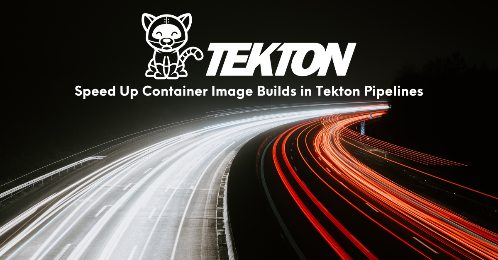
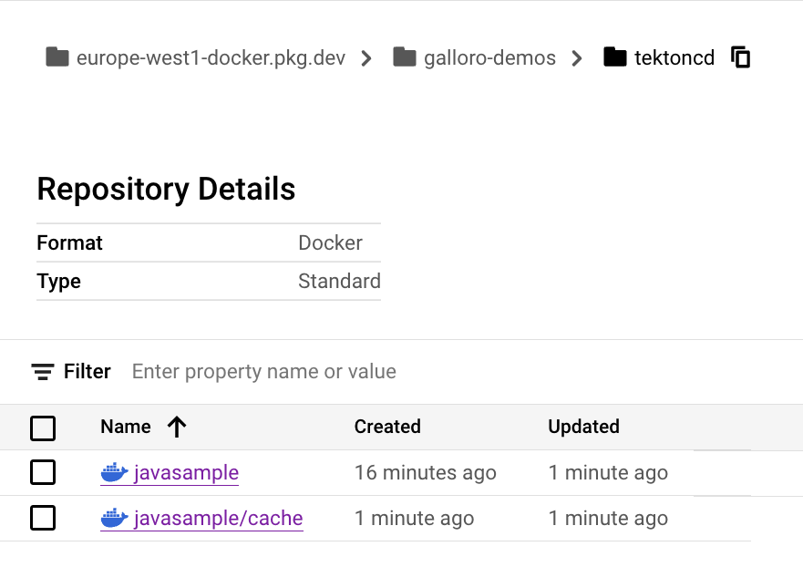
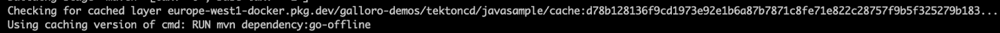
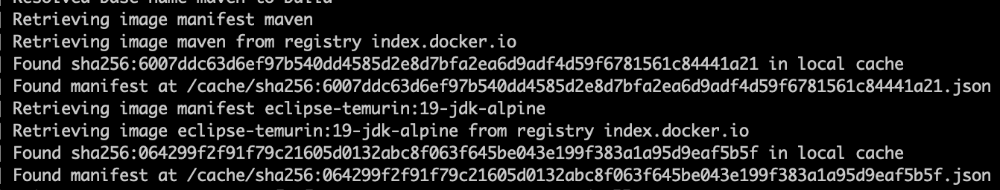

## Overview

When DevOps or developer teams evaluate the move from a persistent CI server (or a CI server using persistent workers) to a system using non-persistent workers backed by Kubernetes pods, such as Tekton Pipelines, they might also wonder how to speed up container image building using cached layers. While using cached layers is relatively easy when builds always run on the same server where layers can be stored locally, it is more challenging in an environment where the builds are run in non-persistent containers on Kubernetes. This article will show how to use Kaniko caching capabilities to speed up builds in your Tekton Pipeline. 





## Tekton Pipelines

[Tekton](https://tekton.dev/) is a powerful and flexible, open source, cloud-native framework for creating CI/CD systems, allowing developers to build, test, and deploy across cloud providers and on-premise systems.

Tekton consists of multiple projects. Among them is [Tekton Pipelines](https://tekton.dev/docs/pipelines/pipelines/), which provides the basic building blocks, in the form of Kubernetes CRDs, for creating CI/CD pipelines, whose tasks run as pods managed and orchestrated by Kubernetes. 

The main building blocks are:


* **Step**: smaller execution unit of a pipeline, is a Kubernetes container specification and includes the container image and all the info you need to run it, as the command or environment variables. It defines a step of your pipeline as “mvn package” or “docker build”. It is defined inside the Task Kubernetes custom resource.
* **Task**: Kubernetes custom resource, defines a sequence of Steps running in sequential order on a single pod in the same Kubernetes node.
* **Pipeline**: A group of tasks that you can configure to run in parallel or in sequence, it represents your CI/CD pipeline.
* **TaskRun**: Specific instance of a Task, linking it to parameters related to a specific environment or application. (For example: git repository, target container image to build, or target environment to deploy to.)
* **PipelineRun**: Specific instance of a Pipeline associating it to parameters.

You will find more information and tutorials in the [Tekton Documentation](https://tekton.dev/docs/) 


## Speeding up container image builds on Tekton

Running build steps as containers in Kubernetes has multiple advantages like portability, reusability, and the possibility to leverage all the capabilities of the underlying Kubernetes platform, but since these containers aren’t persistent by nature, optimizing the build execution through caching would need some additional actions compared to what you were used to do in a standalone CI server.

In the following sections, you will see some examples of how to use caching to speed up image builds in Tekton pipelines using Kaniko. [Kaniko](https://github.com/GoogleContainerTools/kaniko) is an open source tool that can be used to build container images from a Dockerfile. It doesn’t require a Docker daemon to run, which makes it ideal for building images in environments where Docker daemons aren’t available or can’t be run, such as Kubernetes clusters.

To run through the examples you will need a Kubernetes cluster with [Tekton Pipelines installed](https://tekton.dev/docs/installation/pipelines/), a git-based Source Code Management (SCM), and a container registry with permissions to push artifacts. I used a GKE cluster on Google Cloud, a GitHub repository, and Artifact Registry, but steps are reproducible on any standard Kubernetes platform, git based SCM, and container registry with null or minimal modifications.

Example code and assets are available in the: [tekton-speed-builds](https://github.com/tektoncd/website/tree/main/content/en/blog/2023/speeding-up-container-image-builds-in-tekton-pipelines/tekton-speed-builds) folder of the [Tekton CD Website repo](https://github.com/tektoncd/website)

To follow along you need to clone the [Tekton CD Website repo](https://github.com/tektoncd/website) locally and then copy and activate the [tekton-speed-builds](https://github.com/tektoncd/website/tree/main/content/en/blog/2023/speeding-up-container-image-builds-in-tekton-pipelines/tekton-speed-builds) folder as a new repo in your personal GitHub account or other git-based SCM if different.


### Experiment the default behavior

After you have your copy of the example repository clone it locally and look at its content:

* The [sample-app](https://github.com/tektoncd/website/tree/main/content/en/blog/2023/speeding-up-container-image-builds-in-tekton-pipelines/tekton-speed-builds/sample-app) folder contains source code, Maven project files, and a Dockerfile for an example Spring Boot Java app. Look at the [Dockerfile](https://github.com/tektoncd/website/tree/main/content/en/blog/2023/speeding-up-container-image-builds-in-tekton-pipelines/tekton-speed-builds/sample-app/Dockerfile): it’s multi-staged using the `maven` base image for packaging your code and the `eclipse-temurin:19-jdk-alpine` one to run your application:

```
FROM maven as build
COPY mvnw .
COPY pom.xml .
COPY src src
RUN mvn package -Dmaven.test.skip=true


FROM eclipse-temurin:19-jdk-alpine
COPY --from=build /target/demo-0.0.1-SNAPSHOT.jar app.jar
CMD ["java", "-jar", "app.jar"]

```


* The [tekton-assets](https://github.com/tektoncd/website/tree/main/content/en/blog/2023/speeding-up-container-image-builds-in-tekton-pipelines/tekton-speed-builds/tekton-assets) folders contain resource manifests for the Tekton assets used in this article:
    * [pipeline.yaml](https://github.com/tektoncd/website/tree/main/content/en/blog/2023/speeding-up-container-image-builds-in-tekton-pipelines/tekton-speed-builds/tekton-assets/pipeline.yaml) defines a pipeline running 2 Tasks:
        * [git-clone.yaml](https://github.com/tektoncd/website/tree/main/content/en/blog/2023/speeding-up-container-image-builds-in-tekton-pipelines/tekton-speed-builds/tekton-assets/git-clone.yaml) clones the example repo to the source Tekton workspace 
        * [image-build.yaml](https://github.com/tektoncd/website/tree/main/content/en/blog/2023/speeding-up-container-image-builds-in-tekton-pipelines/tekton-speed-builds/tekton-assets/image-build.yaml) runs Kaniko to build a container image from the source code cloned in the workspace and push it to the target container registry
    * [source-pvc.yaml](https://github.com/tektoncd/website/tree/main/content/en/blog/2023/speeding-up-container-image-builds-in-tekton-pipelines/tekton-speed-builds/tekton-assets/source-pvc.yaml) is the manifest for the source-pvc persistent volume claim that will be used as persistent storage for the source Tekton workspace. The storage class is intentionally not defined to make it portable so it will use whatever is the default on your cluster, you can modify the manifest to use your preferred storage class.
* The [kaniko-basecache](https://github.com/tektoncd/website/tree/main/content/en/blog/2023/speeding-up-container-image-builds-in-tekton-pipelines/tekton-speed-builds/kaniko-basecache), [kaniko-cache](https://github.com/tektoncd/website/tree/main/content/en/blog/2023/speeding-up-container-image-builds-in-tekton-pipelines/tekton-speed-builds/kaniko-cache), and [m2cache](https://github.com/tektoncd/website/tree/main/content/en/blog/2023/speeding-up-container-image-builds-in-tekton-pipelines/tekton-speed-builds/m2cache) folders contain example resources useful to implement the various caching options.

Let’s create the needed Tekton resources and run our pipeline. From your locally cloned repository, apply the resources in the tekton-assets folder to your cluster:


```
kubectl apply -f tekton-assets
```


This will create the pvc, tasks, and pipeline described above.

Now let’s start our pipeline manually. Depending on your configuration you may need to specify, using the -s parameter, a Service Account to authenticate to the registry to push the image, check [this section](https://tekton.dev/docs/how-to-guides/kaniko-build-push/#container-registry-authentication) of the Tekton docs for more info. 

Type the following command to start the pipeline


```
tkn pipeline start pipeline-clone-and-build --workspace name=source,claimName=source-pvc --showlog
```


When prompted for the value of the `git-url` parameter, type your git repository url.

When prompted for the value of the `image-name` parameter, type your container image url including the repo and image name.

Here’s an example configuration:


```
➜  ~ tkn pipeline start pipeline-clone-and-build --workspace name=source,claimName=source-pvc --showlog
? Value for param `git-url` of type `string`? https://github.com/ggalloro/tekton-speed-builds
? Value for param `image-name` of type `string`? europe-west1-docker.pkg.dev/galloro-demos/tektoncd/javasample
```


The pipeline will start and you will see the output of the steps executed.

If your pipeline run is successful the last step of the image-build task will print your image url in the console and you will have your image pushed to your target registry:


```
[image-build : write-url] europe-west1-docker.pkg.dev/galloro-demos/tektoncd/javasample:457848d
```


The pipeline execution created 2 TaskRun resources to execute the 2 tasks, type the following command to see the TaskRun information:


```
tkn tr ls
```


You will get an output similar to the one below:


```
NAME                                             STARTED          DURATION   STATUS
pipeline-clone-and-build-run-68hjg-image-build   4 minutes ago    50s        Succeeded
pipeline-clone-and-build-run-68hjg-git-clone     4 minutes ago    11s        Succeeded
```


Since your build will always run in a new container, if you change just a line in your source code your build will always need to download the base images and the Maven dependencies and can’t leverage any cache, let’s try that.

Change the text in line 25 of the [index.html](https://github.com/tektoncd/website/tree/main/content/en/blog/2023/speeding-up-container-image-builds-in-tekton-pipelines/tekton-speed-builds/sample-app/src/main/resources/templates/index.html) file in [sample-app/src/main/resources/templates](https://github.com/tektoncd/website/tree/main/content/en/blog/2023/speeding-up-container-image-builds-in-tekton-pipelines/tekton-speed-builds/sample-app/src/main/resources/templates) to “Hello, Slow Builder!”

Commit your change and push it to your remote repository:


```
git add .
git commit -m "change to index.html"
git push
```


Start your pipeline again following the same instructions given above.

After the Pipeline run completes look at your TasRuns info again:


```
NAME                                             STARTED          DURATION   STATUS
pipeline-clone-and-build-run-fnzxj-image-build   55 seconds ago   49s        Succeeded
pipeline-clone-and-build-run-fnzxj-git-clone     1 minute ago     12s        Succeeded
pipeline-clone-and-build-run-68hjg-image-build   4 minutes ago    50s        Succeeded
pipeline-clone-and-build-run-68hjg-git-clone     4 minutes ago    11s        Succeeded
```


As you can see, even if you change just one line of code, the build needs approximately the same time to execute. In the next sections, we will explore the options to optimize build speed through caching.


### Caching layers in a container registry

Kaniko can cache layers created by RUN and COPY commands in a remote repository. Before running a command, Kaniko checks the cache for the layer. If the layer exists in the cache, Kaniko will pull and extract it instead of running the command. If the layer doesn’t exist in the cache, Kaniko will run the command and then push the newly created layer to the cache.

This can help speed up builds in Tekton.

To use Kaniko cache you must add the `--cache=true` flag to Kaniko in our image-build Task so the build-and-push step reads as follows:


```
- name: build-and-push
      workingDir: $(workspaces.source.path)/sample-app/
      image: gcr.io/kaniko-project/executor:latest
      args:
        - --dockerfile=$(params.DOCKERFILE)
        - --context=$(params.CONTEXT) # The user does not need to care the workspace and the source.
        - --destination=$(params.IMAGE):$(params.commit)
        - --digest-file=$(results.IMAGE_DIGEST.path)
        - --cache=true
      securityContext:
        runAsUser: 0
```


To do that you can apply the modified [image-build-cache.yaml](https://github.com/tektoncd/website/tree/main/content/en/blog/2023/speeding-up-container-image-builds-in-tekton-pipelines/tekton-speed-builds/kaniko-cache/image-build-cache.yaml) in the [kaniko-cache](https://github.com/tektoncd/website/tree/main/content/en/blog/2023/speeding-up-container-image-builds-in-tekton-pipelines/tekton-speed-builds/kaniko-cache) folder to update the image-build Task:


```
kubectl apply -f kaniko-cache/image-build-cache.yaml
```


To leverage Kaniko layer caching capabilities you should also properly configure your Dockerfile to move the directives that are unlikely to change between builds to the top and the ones that are likely to change to the bottom.

Let’s edit the Dockerfile in the sample-app directory to separate the Maven dependency download from the code build so the dependencies are cached in a separate layer from the software artifact and any change to the code won’t cause the dependencies to be downloaded again. Add the `RUN mvn dependency:go-offline` line to your Dockerfile so it reads as follows:


```
FROM maven as build
COPY mvnw .
COPY pom.xml .
RUN mvn dependency:go-offline
COPY src src
RUN mvn package -Dmaven.test.skip=true


FROM eclipse-temurin:19-jdk-alpine
COPY --from=build /target/demo-0.0.1-SNAPSHOT.jar app.jar
CMD ["java", "-jar", "app.jar"]
```


Once you changed your Dockerfile you need to commit and push your changes so your build will use it:


```
git add .
git commit -m "update to Dockerfile"
git push
```


Now run your pipeline again as you did before, the first execution output should be similar to the previous run, and all the dependencies will be downloaded.

Let’s look at the TaskRun info. The build duration should be similar to the previous as well (although it might be  a bit longer due to the upload of layers to the registry):


```
NAME                                             STARTED          DURATION   STATUS
pipeline-clone-and-build-run-gsgwx-image-build   1 minute ago     58s        Succeeded
pipeline-clone-and-build-run-gsgwx-git-clone     1 minute ago     17s        Succeeded
pipeline-clone-and-build-run-fnzxj-image-build   55 seconds ago   49s        Succeeded
pipeline-clone-and-build-run-fnzxj-git-clone     1 minute ago     12s        Succeeded
pipeline-clone-and-build-run-68hjg-image-build   4 minutes ago    50s        Succeeded
pipeline-clone-and-build-run-68hjg-git-clone     4 minutes ago    11s        Succeeded

```


The image layers have been uploaded to your registry, as you can see in the picture below for Artifact Registry (javasample/cache folder):





Now let’s update the code (use “Hello, Fast Builder!” this time), commit your changes, and run the pipeline again following the instructions from the previous section. From the output log, you should note that the bulk of dependencies will not be downloaded again and the cached layer should be used:





The image-build TaskRun execution should be faster compared to the previous execution (42 vs 58 sec in this example): 


```
NAME                                             STARTED         DURATION   STATUS
pipeline-clone-and-build-run-5s87p-image-build   1 minute ago     42s        Succeeded
pipeline-clone-and-build-run-5s87p-git-clone     1 minute ago     17s        Succeeded
pipeline-clone-and-build-run-gsgwx-image-build   7 minutes ago    58s        Succeeded
pipeline-clone-and-build-run-gsgwx-git-clone     7 minutes ago    17s        Succeeded
pipeline-clone-and-build-run-fnzxj-image-build   18 minutes ago   49s        Succeeded
pipeline-clone-and-build-run-fnzxj-git-clone     18 minutes ago   12s        Succeeded
pipeline-clone-and-build-run-68hjg-image-build   21 minutes ago   50s        Succeeded
pipeline-clone-and-build-run-68hjg-git-clone     22 minutes ago   11s        Succeeded
```


You have experienced how enabling caching layers to a container registry can improve your build speed on Tekton, the effective speed gain would depend on various factors such as project configuration and connection to your registry.


### Caching base images on a persistent disk

In addition to cache layers on your container registry, Kaniko can use a persistent volume to store cached base images. By default, Kaniko will look for cached base images in the `/cache` folder but you can customize that with the `--cache-dir` flag. 

The persistent volume must be populated before usage, Kaniko provides an image for doing that: `gcr.io/kaniko-project/warmer`

Let’s add a volume mount mapping the `/cache` path to a PVC named `basechache-pvc` to our build-image Task:


```
- name: build-and-push
      workingDir: $(workspaces.source.path)/sample-app/
      image: gcr.io/kaniko-project/executor:latest
      args:
        - --dockerfile=$(params.DOCKERFILE)
        - --context=$(params.CONTEXT) # The user does not need to care the workspace and the source.
        - --destination=$(params.IMAGE):$(params.commit)
        - --digest-file=$(results.IMAGE_DIGEST.path)
        - --cache=true
      # kaniko assumes it is running as root, which means this example fails on platforms
      # that default to run containers as random uid (like OpenShift). Adding this securityContext
      # makes it explicit that it needs to run as root.
      securityContext:
        runAsUser: 0
      volumeMounts:
        - name: basecache
          mountPath: /cache
    - name: write-url
      image: docker.io/library/bash:5.1.4@sha256:b208215a4655538be652b2769d82e576bc4d0a2bb132144c060efc5be8c3f5d6
      script: |
        set -e
        image="$(params.IMAGE):$(params.commit)"
        echo -n "${image}" | tee "$(results.IMAGE_URL.path)"
  volumes:
    - name: basecache
      persistentVolumeClaim:
        claimName: basecache-pvc
```


To do that you can apply the modified [image-build-basecache.yaml](https://github.com/tektoncd/website/tree/main/content/en/blog/2023/speeding-up-container-image-builds-in-tekton-pipelines/tekton-speed-builds/kaniko-basecache/image-build-basecache.yaml) in the [kaniko-basecache](https://github.com/tektoncd/website/tree/main/content/en/blog/2023/speeding-up-container-image-builds-in-tekton-pipelines/tekton-speed-builds/kaniko-basecache) folder to update the image-build Task:


```
kubectl apply -f kaniko-basecache/image-build-basecache.yaml
```


Now let’s create the basecache-pvc PVC:


```
kubectl apply -f kaniko-basecache/pvc-basecache.yaml
```


Then, run the `kaniko-warmer` pod to populate the disk:


```
kubectl apply -f kaniko-basecache/kaniko-warmer.yaml
```


Check the `kaniko-warmer` pod logs:


```
kubectl logs -f kaniko-warmer
```


Until you get the output confirming that the 2 base images have been downloaded


```
INFO[0000] Retrieving image manifest maven              
INFO[0000] Retrieving image maven from registry index.docker.io 
INFO[0004] Retrieving image manifest eclipse-temurin:19-jdk-alpine 
INFO[0004] Retrieving image eclipse-temurin:19-jdk-alpine from registry index.docker.io
```


When done you can make a change to your code again (“Hello, Base Builder!”) commit it and start your pipeline again as done in the previous tests.

This execution will leverage cached layers as the previous one and, in addition to that, will use the base images from your `basecache-pvc` persistent volume, as you can see in the output:





Even in this case, the speed improvement will depend on various factors such as how big your  base images are, storage performance, and your registry connection.


### Caching dependencies on a persistent disk

Another option to speed up builds is to cache dependencies locally. In our example Maven project we can leverage the fact that by default, maven caches the dependency modules into $HOME/.m2 directory. This possibility depends on the language and build tools you are using.

In this example, we will add another persistent volume to the build-image task and map it to the /root/.m2 folder to persist the Maven cache between builds.

Let’s apply the modified [image-build-m2cache.yaml](https://github.com/tektoncd/website/tree/main/content/en/blog/2023/speeding-up-container-image-builds-in-tekton-pipelines/tekton-speed-builds/m2cache/image-build-m2cache.yaml) in the [m2cache](https://github.com/tektoncd/website/tree/main/content/en/blog/2023/speeding-up-container-image-builds-in-tekton-pipelines/tekton-speed-builds/m2cache) folder to update the image-build Task:


```
kubectl apply -f m2cache/image-build-m2cache.yaml
```


Now let’s create the `m2cache-pvc` PVC:


```
kubectl apply -f m2cache/pvc-m2cache.yaml
```


Since we don’t need to cache Maven dependencies in an image layer anymore, let’s remove the `RUN mvn dependency:go-offline `line` `from our Dockerfile and revert to its original structure. Commit and push your changes after that.

Now run your pipeline again as you did before, Maven will download your dependencies again when the `mvn package` is run since your previously cached layer is not referenced anymore in your Dockerfile. Duration should be similar to our initial test.

Make a change to your code again (“Hello, Very Fast Builder”), commit it, and start your pipeline again as done in the previous tests.

This execution will leverage cached layers as the previous one and, in addition to that, will use the base images from your basecache-pvc persistent volume and cached dependencies.

Even in this case, if you look at your TaskRun list, you should see a speed improvement compared to the first run:


```
NAME                                             STARTED          DURATION   STATUS
pipeline-clone-and-build-run-lk8x2-image-build   1 minute ago     46s        Succeeded
pipeline-clone-and-build-run-lk8x2-git-clone     1 minute ago     14s        Succeeded
pipeline-clone-and-build-run-w7sd5-image-build   3 minutes ago    59s        Succeeded
pipeline-clone-and-build-run-w7sd5-git-clone     3 minutes ago    12s        Succeeded
```


# Summary

You saw multiple options to leverage different types of caching to speed up image builds in Tekton using Kaniko:


* How to cache layers in your container registry
* How to use cached base images in a persistent volume
* How to host your local dependencies cache on a persistent volume 

Now, you are ready to speed up your build in Tekton !

### Note
This blog was originally posted in the [Continuous Delivery Foundation Blog](https://cd.foundation/blog/2023/10/12/speed-up-container-image-builds-tekton-pipelines/)
