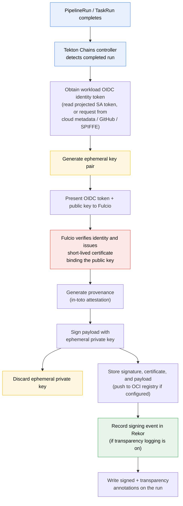

Traditional signing hands you a long-lived private key and a list of problems: where do you store it, how do you rotate it, who gets access, and what happens when it leaks? In an automated CI/CD pipeline that runs hundreds of builds a day, a key sitting in a secret store is both an operational burden and an attractive target.

[Sigstore](https://www.sigstore.dev/) reframes the problem around *identity* instead of *keys*, and [Tekton Chains](https://tekton.dev/docs/chains/) brings that model into your pipelines. This post covers how it works inside Chains, how to enable it, and the caveats that still apply.

## What Tekton Chains is

Tekton Chains is a Kubernetes controller that observes `TaskRun` and `PipelineRun` resources in your cluster. When a run completes, Chains automatically captures what was built, generates signed provenance describing how it was built, signs the result, and optionally records the signing event in a transparency log. You don't add signing steps to your pipelines; Chains runs out-of-band and reacts to completed runs.

It can sign three kinds of subjects: OCI images, `TaskRuns`, and `PipelineRuns`. Provenance is emitted as [in-toto attestations](https://in-toto.io/), which describe the inputs, steps, and outputs of a build in a structured, verifiable format useful for auditing and for satisfying [SLSA](https://slsa.dev/)-style policy requirements.

## The keyless idea

Instead of holding a signing key, a Sigstore client generates an ephemeral key pair for a single signing operation. It presents an OIDC identity token to [Fulcio](https://docs.sigstore.dev/certificate_authority/overview/), Sigstore's free certificate authority. Fulcio verifies the token and issues a short-lived certificate that binds the freshly generated public key to the identity in the token. The client signs the artifact, the signing event is recorded in [Rekor](https://docs.sigstore.dev/logging/overview/) (the transparency log), and the private key is discarded immediately. There is no key to store, rotate, or leak. Verification later relies on the certificate, the recorded identity, and the transparency log entry rather than on a key you have to distribute.

The key point for CI: the OIDC identity doesn't have to be a human — it can be a workload, which is exactly what Tekton Chains uses.

## How keyless works inside Tekton Chains

In keyless mode, Chains does not look for a signing secret. Instead it obtains a workload identity token from its runtime environment, then uses that token to obtain a Fulcio certificate for the artifact being signed. This is the same OIDC signing flow [Cosign](https://docs.sigstore.dev/cosign/overview/) uses, but the token represents a workload rather than a human who completed a browser login.

The mechanism that makes this work on managed Kubernetes is the cluster's OIDC provider combined with [projected service account tokens](https://kubernetes.io/docs/tasks/configure-pod-container/configure-service-account/#serviceaccount-token-volume-projection). The cluster issues a short-lived, audience-scoped token representing the workload's service account identity; the kubelet mounts and refreshes it as a file in the Chains pod, Chains reads that file, and Fulcio accepts the token as proof of identity. This has been tested on GKE, EKS, and AKS, and should work on any environment that supports Cosign OIDC signing.

That token source is pluggable. Chains links in Cosign's identity providers and picks the first one enabled, or whichever you pin with `signers.x509.fulcio.provider`. The projected-token path above just reads a mounted file, but the same flow can instead request a token directly from the platform's identity endpoint — a cloud metadata server (e.g. GKE Workload Identity), GitHub Actions OIDC, or a [SPIFFE](https://spiffe.io/) workload-API socket.

The examples below target the public Sigstore deployment (`fulcio.sigstore.dev` and `rekor.sigstore.dev`), but the flow is identical against a private deployment: many enterprise and on-prem setups run their own Fulcio and Rekor and simply point `signers.x509.fulcio.address` and `transparency.url` at those instances. See the [public vs. private infrastructure](#caveats) caveat below for the trade-offs.

The full flow looks like this:



Once Chains has obtained a certificate and signed the payload — the in-toto attestation for a `TaskRun` or `PipelineRun`, or the image manifest for an OCI subject — it marks the run with a `chains.tekton.dev/signed: true` annotation and, if transparency logging is on, a `chains.tekton.dev/transparency` URL pointing at the Rekor entry. The signature, certificate, and payload themselves go wherever you configured storage: base64-encoded annotations on the run with the default `tekton` backend, or pushed to your registry with the `oci` backend.

## Turning it on

Enabling keyless mode is a one-line change to the Chains config map. You switch on the Fulcio signer:

```shell
kubectl patch configmap chains-config -n tekton-chains \
  -p='{"data":{"signers.x509.fulcio.enabled": "true"}}'
```

This single flag is enough on a standard install because the default Chains deployment already projects a short-lived, `sigstore`-audience service account token into the controller at `/var/run/sigstore/cosign/oidc-token` (the `oidc-info` volume), and the kubelet refreshes it automatically before it expires. The Fulcio signer reads that file on each run. If a hardened or customized deployment has removed that volume, keyless fails with `no auth provider for fulcio is enabled`; restore the projected token, or supply identity another way — cloud workload identity, a SPIFFE SVID, or a token file referenced by `signers.x509.identity.token.file`.

A more complete configuration that signs in-toto provenance, stores signatures in your OCI registry, and records events in the public Rekor instance looks like this:

```yaml
apiVersion: v1
kind: ConfigMap
metadata:
  name: chains-config
  namespace: tekton-chains
data:
  # What to sign and how to format it
  artifacts.taskrun.format: "in-toto"
  artifacts.taskrun.storage: "oci"
  artifacts.taskrun.signer: "x509"

  # Sign PipelineRuns too — provenance pushed to the OCI registry
  artifacts.pipelinerun.format: "in-toto"
  artifacts.pipelinerun.storage: "oci"
  artifacts.pipelinerun.signer: "x509"

  # OCI image signature storage
  artifacts.oci.storage: "oci"
  artifacts.oci.format: "simplesigning"
  artifacts.oci.signer: "x509"

  # Transparency log
  transparency.enabled: "true"
  transparency.url: "https://rekor.sigstore.dev"

  # Keyless: use Fulcio instead of a stored key
  signers.x509.fulcio.enabled: "true"
  signers.x509.fulcio.address: "https://fulcio.sigstore.dev"
```

On a supported managed cluster the only setting keyless strictly requires is `signers.x509.fulcio.enabled: "true"`; the `address` line above just spells out the public-Sigstore default. Note that the example deliberately does **not** set `signers.x509.fulcio.issuer`. That value defaults to the public Sigstore broker (`https://oauth2.sigstore.dev/auth`) and is the *expected OIDC issuer* — you only override it when you run a private OIDC provider or a self-hosted Fulcio, in which case it must be your cluster's own OIDC issuer rather than a Sigstore URL. You can look that up with:

```shell
kubectl get --raw /.well-known/openid-configuration | jq -r .issuer
```

How does Chains know what a run produced? It inspects the completed `TaskRun` or `PipelineRun` — its parameters, steps, and especially its results. *Type-hinting* results such as `IMAGE_URL` and `IMAGE_DIGEST` (or `ARTIFACT_OUTPUTS`) are how your `Task` tells Chains which image it built, and that feeds both the provenance and where the signature lands. It matters for the storage choice above: with `storage: "oci"` and no `storage.oci.repository` set, Chains stores the attestation alongside that image, which only works if those type-hinting results are present. If your run doesn't build an image, set `storage.oci.repository` explicitly or choose a different backend. The [Chains configuration reference](https://tekton.dev/docs/chains/config/) lists every storage option, and the [Artifact Storage in Tekton Chains](/blog/2026/artifact-storage-tekton-chains/) post walks through them in depth.

Transparency logging is its own toggle, defaulting to the public Rekor instance, and you can point it at a private Rekor if you run one:

```shell
kubectl patch configmap chains-config -n tekton-chains \
  -p='{"data":{"transparency.enabled": "true"}}'

kubectl patch configmap chains-config -n tekton-chains \
  -p='{"data":{"transparency.url": "<YOUR URL>"}}'
```

Pushing signatures and provenance to an OCI registry requires the controller to authenticate to that registry. See the [Chains authentication guide](https://tekton.dev/docs/chains/authentication/) for how to set that up.

## Verifying what you signed

Signing is pointless if no one verifies the result. The question that matters isn't whether something was signed — Chains signs everything — but whether a *consumer* can verify that an artifact came from where they expect before trusting it. Because keyless signing records every event in Rekor, that verification doesn't depend on holding a key; it depends on matching the recorded identity against what you expect and confirming the artifact's entry is in the log.

Concretely, a consumer verifies that the signing certificate's identity is the build workload they trust — not merely *some* valid Sigstore identity — that the signature covers the artifact in hand, and that the attached provenance describes the build they expected. The transparency annotation on each run holds the Rekor entry URL, and you can explore entries through Rekor's API or a web UI; the Chainguard team runs a public [Rekor Search UI](https://rekor.tlog.dev/) where you can look up entries by log index, email, hash, commit SHA, or UUID. Producers can use that same searchability to watch for unexpected use of their identity, but that monitoring is a secondary benefit — the real payoff is giving consumers something concrete to check against policy.

## Signing options today

Keyless is one of several signing modes. Operationally you choose one:

- **Keyless / Fulcio** — no stored key; identity comes from the cluster's OIDC token. The focus of this post.
- **x509** — an unencrypted PKCS8 PEM private key (`ed25519` or `ecdsa`) stored in a `signing-secrets` Kubernetes secret.
- **Cosign keypair** — an encrypted Cosign-generated key (`cosign.key` plus `cosign.password`) in the same secret, created via `cosign generate-key-pair k8s://tekton-chains/signing-secrets`.
- **KMS** — a key held in a cloud KMS, referenced with a go-cloud-style URI using one of the supported schemes: `gcpkms://`, `awskms://`, `azurekms://`, or `hashivault://`.

One subtlety this hides: the `signer` field in the config only ever takes `x509` or `kms` per artifact type (or `none` to skip signing). The first three options above are all the `x509` signer; Chains tells keyless, a raw x509 key, and a Cosign keypair apart by whether `signers.x509.fulcio.enabled` is set and which keys exist in the `signing-secrets` secret, not by a separate top-level setting. (That's also why there's no `cosign` signer value — a Cosign keypair is just the `x509` signer reading `cosign.key`.)

The progression runs from "least key management" to "most control over the key": keyless removes key management entirely, while KMS keeps the key in cloud infrastructure you control. Keyless suits public, auditable artifacts; KMS suits regulatory or air-gap constraints.

## What's possible right now — and the caveats {#caveats}

With keyless enabled, every `TaskRun` and `PipelineRun` in the cluster gets signed provenance bound to a workload identity, with no key to manage and a public audit trail in Rekor — from a single config flag on managed Kubernetes.

A few realities to plan around:

- **OIDC token format matters.** Chains v0.25.1 and later ship Cosign v2.6.0 or newer (the current release line vendors v2.6.3), which no longer accepts HS256-signed JWTs. Public Sigstore (Fulcio), key-based signing, and private OIDC providers using RS256 are unaffected, but if you run a private OIDC provider on HS256 you must switch to RS256 before upgrading to v0.25.1 or above. This is the kind of detail that silently breaks a pipeline, so check it before you bump versions.
- **Cluster OIDC is a prerequisite.** Keyless mode depends on your cluster being able to issue projected service account tokens that Fulcio trusts. On EKS, for example, that means creating the cluster with OIDC enabled (`eksctl create cluster --with-oidc ...`). On a cluster without a usable OIDC provider, keyless won't work and you'll fall back to a key-based mode. The public Fulcio trusts the GKE and EKS cluster issuers out of the box; AKS and other providers may require the issuer you use to be accepted by the Fulcio instance you target (or a self-hosted Fulcio configured to trust it).
- **"Keyless" is a convenience, not the literal absence of keys.** Fulcio still operates a root of trust on behalf of the whole community, protected by a distributed key ceremony and [The Update Framework](https://theupdateframework.io/). The point isn't that keys vanish — it's that *you* no longer manage signing keys.
- **Public vs. private infrastructure is a real choice.** Signing against the public Fulcio and Rekor means your identities and signing metadata land in public logs, which may be undesirable for internal-only artifacts. You can self-host Fulcio and Rekor to run an entirely private signing stack. If your workloads carry [SPIFFE/SVID](https://spiffe.io/) identities, Chains can authenticate to Fulcio with an SVID instead of a service account token. Either way, running your own stack is meaningfully more work than flipping a flag.
- **A signature is not a safety verdict.** Chains signs every run unconditionally — it cannot, and does not, judge whether what was built is any good. A signature and its provenance record *who* built an artifact and *how*, not *whether it should be trusted*; on their own they are closer to an empty attestation than a stamp of approval. A compromised build emits perfectly valid signatures and provenance, which is exactly how recent attacks shipped malicious npm packages carrying legitimate provenance. Treat Chains' output as verifiable *input* to a trust decision, never as the decision itself.
- **Verification and policy are on you.** Chains makes signing automatic; it does not make anyone check the result. The value only materializes when a consumer enforces expectations — a policy gate such as Sigstore's [Policy Controller](https://docs.sigstore.dev/policy-controller/overview/) that admits an artifact only when it was signed by the *specific* build identity you expect, from the source you expect, with provenance meeting the [SLSA](https://slsa.dev/) level you require. Signing without that gate proves an artifact's origin to no one in particular.

## Where this fits

Keyless signing with Tekton Chains gives you verifiable provenance for what your pipeline builds, attributed to a workload identity, with no signing key to manage. That provenance records how and by what each artifact was built. It does not assert the artifact is safe to use — that is a separate decision a consumer makes by verifying the provenance against policy.

Chains is one piece of the supply chain toolchain, and each piece has a distinct job:

- **[in-toto](https://in-toto.io/)** is the *format* — the structured, signable attestation that carries the provenance.
- **[SLSA](https://slsa.dev/)** is the *standard* — it defines what trustworthy provenance must contain and ranks build integrity in levels you can target and require.
- **[Policy Controller](https://docs.sigstore.dev/policy-controller/overview/)** is the *enforcement* — admission-time checks that verify those signatures and attestations against your policy before an artifact is deployed.

Signing is necessary but not sufficient. Tekton Chains gives you auditable provenance bound to workload identities; turning that into protection means a consumer closing the loop with verification and policy. Every piece you need for that exists and is open source today.

To go deeper, see the [Tekton Chains documentation](https://tekton.dev/docs/chains/) and the [Sigstore project documentation](https://docs.sigstore.dev/).
