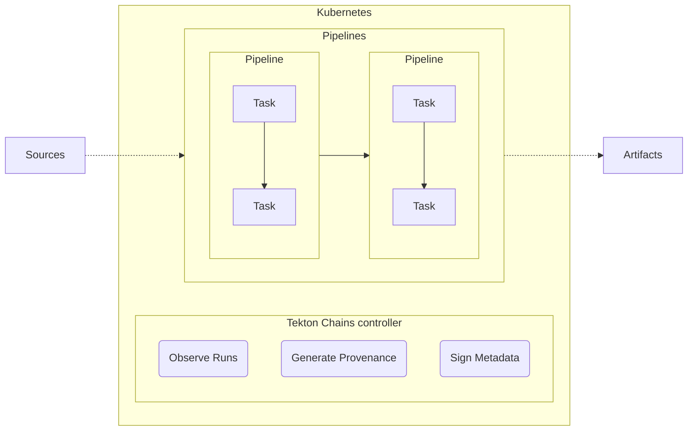

<!--
---
title: "Supply Chain Security"
linkTitle: "Supply Chain Security"
weight: 3
description: >
  Overview of Supply Chain Security 
---
-->

Given the increasing complexity of the CI/CD space, with projects that often
have dozens or even hundreds of dependencies, the supply chain has become a
common vector of attacks. Tekton Chains is a security-oriented part of the
Tekton portfolio to help you mitigate security risks. 

Tekton Chains is a tool to generate, store, and sign provenance for artifacts
built with Tekton Pipelines. **Provenance** is metadata containing verifiable
information about software artifacts, describing where, when and how something
is built.

## How to secure your Supply Chain

[Supply chain Levels for Software Artifacts (SLSA)][slsa] provides a set of
guidelines you can follow to make your software more secure. SLSA is organized
into a series of levels, where level 4 represents the ideal state. Go to
[slsa.dev](https://slsa.dev) for more information.

Tekton Chains implements the SLSA guidelines to help you accomplish SLSA level
2, by documenting the build process in a tamper resistant format.

## How does Tekton Chains work?

Tekton Chains works by deploying a controller that runs in the background and
monitors TaskRuns. While Tekton Pipelines executes your Tasks, Tekton Chains
watches the operation, once the operation is successfully completed, the Chains
controller generates the provenance for the artifacts produced.

The provenance records the inputs of your Tasks: source repositories, branches,
other artifacts; and the outputs: container images, packages, etc. This
information is recorded as [in-toto][in-toto] metadata and signed. You can store
the keys to sign the provenance in a Kubernetes secret or by using a supported
key management system: GCP, AWS, Azure, or Vault. You can then upload the
provenance  to a specified location. [Getting To SLSA Level 2 with Tekton and
Tekton Chains][blog-post] on the Google Open Source Blog provides more details.

## Where can I try it?

- For a hands-on experience, follow the [Getting started with Tekton Chains
  tutorial][chains-quickstart].
- Check the [examples available on the Chain repository][chains-examples].

[in-toto]: https://in-toto.io/
[slsa]: https://slsa.dev/spec/v0.1/levels#what-is-slsa
[chains-quickstart]: /docs/getting-started/supply-chain-security/
[chains-examples]: https://github.com/tektoncd/chains/tree/main/examples
[blog-post]: /blog/2023/04/19/getting-to-slsa-level-2-with-tekton-and-tekton-chains/

