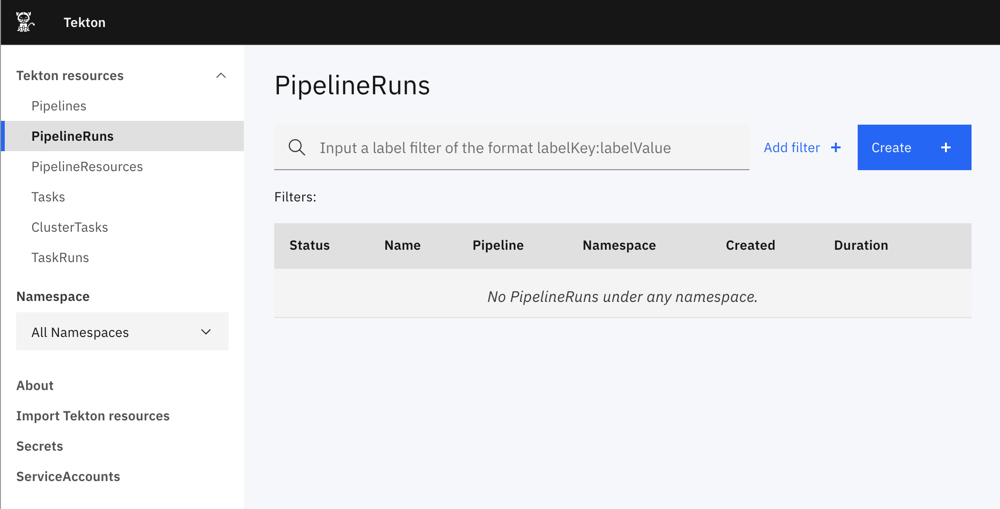

In this section, we will install and expose the Tekton Dashboard.

## Katacoda Kubernetes Cluster

It might take a minute or two for Katacoda to initialize your Kubernetes
cluster. When your cluster has been initialized, the
`kubectl cluster-info`{{execute}} command will return the cluster info.

Now, let's begin!

## Install the Tekton Dashboard Prerequisites

- [Tekton Pipelines](https://github.com/tektoncd/pipeline/blob/master/docs/install.md)
`kubectl apply --filename https://storage.googleapis.com/tekton-releases/pipeline/previous/v0.15.2/release.yaml`{{execute}}

Verify the pods are running:
`kubectl get pods -n tekton-pipelines`{{execute}}

## Install the Tekton Dashboard

For reference, the installation instructions are [here](https://github.com/tektoncd/dashboard#install-dashboard). To install the Tekton Dashboard, run the following
command:
`kubectl apply --filename https://storage.googleapis.com/tekton-releases/dashboard/previous/v0.8.2/tekton-dashboard-release.yaml`{{execute}}

<!-- `kubectl apply --filename https://storage.googleapis.com/tekton-releases/dashboard/latest/release.yaml`{{execute}} -->

Verify the Dashboard pod is running:
`kubectl get pods -n tekton-pipelines`{{execute}}

## Expose the Tekton Dashboard

View the Tekton Dashboard Service:
`kubectl get svc tekton-dashboard -n tekton-pipelines`{{execute}}

The Tekton Dashboard Service is exposed on port `9097`. So, set up a port forward
for the `tekton-dashboard` Service on port `9097`:

```bash
kubectl port-forward -n tekton-pipelines --address=0.0.0.0 service/tekton-dashboard 80:9097 > /dev/null 2>&1 &
```{{execute}}

## Open the Tekton Dashboard

Open the `Dashboard` tab in your Katacoda window, or click on the following link:
https://[[HOST_SUBDOMAIN]]-80-[[KATACODA_HOST]].environments.katacoda.com/.

It might take a minute for the ingress and Katacoda to get set up.


