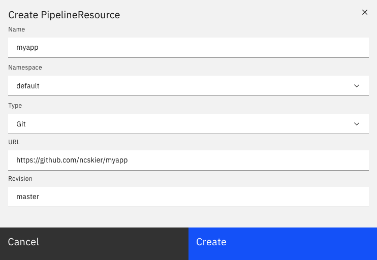

In this section, we will create the git PipelineResource for MyApp. We will
later use this PipelineResource to run the Pipeline to build and deploy MyApp.

## Navigate to the PipelineResources page

Click on the following link to go directly to the PipelineResources page in the
Dashboard:
https://[[HOST_SUBDOMAIN]]-80-[[KATACODA_HOST]].environments.katacoda.com/#/namespaces/default/pipelineresources

Or navigate to the `default` Namespace's PipelineResources page in the Dashboard.

*Make sure the `default` Namespace is selected in the Namespace dropdown.*

## Create the PipelineResource

Click on the blue `Create +` button in the upper right section of the page.

This opens a form to create a PipelineResource. We want to create a git
PipelineResource for the `master` branch of MyApp in the `default` namespace.
So, fill in the form with the following information:

Name: `myapp`{{copy}}

Namespace: `default`

Type: `Git`

URL: `https://github.com/ncskier/myapp`{{copy}}

Revision: `master`{{copy}}

The form should look like the following:

Click the `Create` button to create the PipelineResource.

