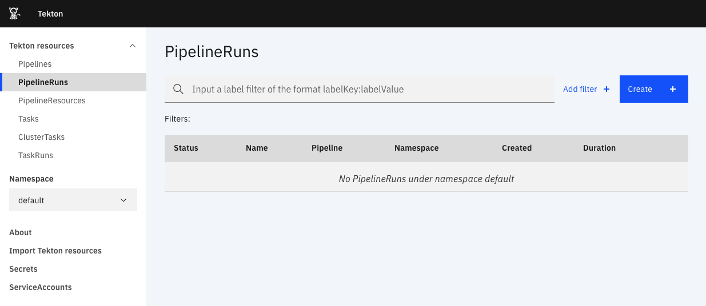

In this section, we will create the PipelineRun to build and deploy MyApp.

## Navigate to the PipelineRuns page

Click on the following link to go directly to the PipelineRuns page in the
Dashboard:
https://[[HOST_SUBDOMAIN]]-80-[[KATACODA_HOST]].environments.katacoda.com/#/namespaces/default/pipelineruns

Or navigate to the `default` Namespace's PipelineRuns page.

## Create the PipelineRun

Click on the blue `Create +` button in the upper right section of the page.

This opens a form to create a PipelineRun. The form is dynamic, and provides
PipelineResource and Param fields based on the selected Pipeline. We want to
create a PipelineRun in the `default` Namespace using the `myapp` Pipeline and
`myapp` PipelineResource. So, fill in the form with the following information:

Namespace: `default`

Pipeline: `myapp`

PipelineResources source: `myapp`{{copy}}

Leave the default values for the rest of the fields.

The form should look like the following:

Click the `Create` button to create the PipelineRun.

